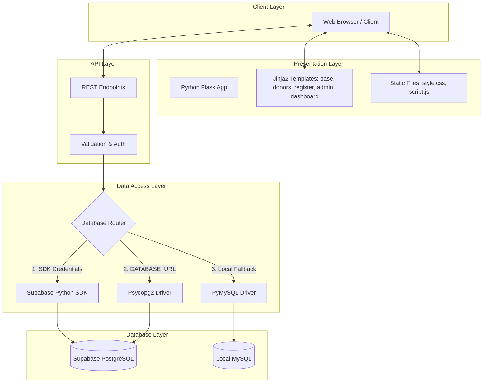

<!-- ============================================================ -->
<!-- COVER PAGE -->
<!-- ============================================================ -->

<div align="center">

# PROJECT REPORT ON
# BLOODLIFE MANAGEMENT SYSTEM
### A Web-Based Blood Donation & Donor Tracking Platform

---

### **SUBMITTED BY (GROUP MEMBERS)**

| SL | Student Name | Student ID |
|:---:|:---|:---|
| **1** | Md. Mushfiq Kabir | 42250202488 |
| **2** | Most. Umme Kulsum | 42250202504 |
| **3** | Nowrin Kabir Agni | 42250202491 |

<br/>

### **SUBMITTED TO**
**M. A. Jobayer Bin Bakkre**  
Department of Computer Science & Engineering  
**Northern University Bangladesh**  

<br/>

**Date of Submission:** 14 August 2026

</div>

<br/>
<hr/>
<br/>

<!-- ============================================================ -->
<!-- MAIN REPORT CONTENT -->
<!-- ============================================================ -->

# Project Report: BloodLife Management System

## Executive Summary

BloodLife is a web application for connecting voluntary blood donors with people who need blood transfusions. Users can search for donors by blood group and location, submit registration forms to become donors, and manage donor records through an administrative dashboard.

The application supports multiple database backends: Supabase (cloud PostgreSQL), direct PostgreSQL, and local MySQL via XAMPP. It falls back automatically based on available environment variables.

---

## 1. Objectives and Scope

### Objectives
- Help users search for and contact blood donors quickly.
- Allow voluntary donors to submit contact information, blood type, age, location, and availability.
- Provide administrators with tools to view statistics, add donors, and delete records.
- Support local offline running and cloud deployment with automatic database fallback.

### Scope of Work
- **Public features**: Donor search, blood group filters for all 8 ABO/Rh types (`A+`, `A-`, `B+`, `B-`, `AB+`, `AB-`, `O+`, `O-`), and a donor registration form with client-side validation.
- **Admin features**: Password-protected login, statistics overview (total and available donors), donor table with modal creation form, and record deletion.
- **API**: JSON REST endpoints for data fetching and state updates.

---

## 2. Architecture and Technology Stack



### Technology Stack

| Layer | Technology | Function |
|---|---|---|
| **Backend** | Python 3 / Flask | HTTP routing, session management, REST API endpoints |
| **Database Drivers** | Supabase SDK, `psycopg2`, `pymysql` | Database connections with automatic fallback |
| **Frontend** | HTML5, CSS3, JavaScript (ES6) | Responsive user interface, AJAX calls, flexbox and grid layouts |
| **Templating** | Jinja2 | HTML template inheritance through `base.html` |
| **Deployment** | Vercel or XAMPP | Serverless deployment on Vercel or local execution with XAMPP |

---

## 3. Database Design

The database contains two tables: `donors` and `admin`.

### Database Schemas

#### 1. `donors` Table

| Field Name | Type (PostgreSQL / MySQL) | Constraints | Description |
|---|---|---|---|
| `id` | `SERIAL` / `INT AUTO_INCREMENT` | PRIMARY KEY | Unique donor ID |
| `name` | `VARCHAR(100)` | NOT NULL | Donor full name |
| `blood_group` | `VARCHAR(5)` / `ENUM` | NOT NULL | Blood type (e.g. A+, O-) |
| `phone` | `VARCHAR(20)` | NOT NULL | Contact phone number |
| `email` | `VARCHAR(100)` | NULLABLE | Email address |
| `location` | `VARCHAR(100)` | NOT NULL | City or area name |
| `address` | `TEXT` | NULLABLE | Street address |
| `message` | `TEXT` | NULLABLE | Optional notes |
| `age` | `INT` | NULLABLE | Age (18 to 65) |
| `gender` | `VARCHAR(10)` / `ENUM` | NULLABLE | Gender selection |
| `last_donation` | `DATE` | NULLABLE | Date of last donation |
| `is_available` | `BOOLEAN` | DEFAULT TRUE | Current availability |
| `created_at` | `TIMESTAMP` | DEFAULT CURRENT_TIMESTAMP | Record creation time |

#### 2. `admin` Table

| Field Name | Type | Constraints | Description |
|---|---|---|---|
| `id` | `SERIAL` / `INT AUTO_INCREMENT` | PRIMARY KEY | Admin ID |
| `username` | `VARCHAR(50)` | NOT NULL, UNIQUE | Login username |
| `password` | `VARCHAR(255)` | NOT NULL | Password hash |
| `created_at` | `TIMESTAMP` | DEFAULT CURRENT_TIMESTAMP | Account creation time |

---

## 4. Key Application Features

### 1. Donor Search (`/donors`)
- Filter donors by name, area, or phone number in real time.
- Filter by blood group using pill buttons for each group.
- Phone link button (`tel:<phone>`) to call donors directly from mobile devices.

### 2. Donor Registration (`/register`)
- Form validation for required fields: name, blood group, phone, and location.
- Phone validation matching Bangladeshi number formats (`/^01[3-9]\d{8}$/`).
- Immediate success and error messages without full page reloads.

### 3. Admin Panel (`/admin`, `/admin/dashboard`)
- Session-backed authentication.
- Real-time counts of total registered donors and available donors.
- Modal dialog for adding new donor entries.
- One-click deletion for donor records.

---

## 5. API Reference

### `GET /api/stats`
Returns system counts and donor distribution data.

```json
{
  "total": 12,
  "available": 12,
  "locations": ["Banani, Dhaka", "Dhanmondi, Dhaka", "Gulshan, Dhaka"],
  "blood_counts": { "A+": 3, "B+": 2, "O+": 2, "AB+": 1 }
}
```

### `GET /api/donors`
Returns donor list with optional filters.
Parameters: `search`, `blood`, `location`.

### `POST /api/donors`
Adds a new donor record.

### `DELETE /api/donors/<donor_id>`
Deletes a donor record (requires admin session).

### `POST /api/login` and `POST /api/logout`
Manages admin sessions.

---

## 6. Setup and Deployment

### Local Setup (XAMPP / MySQL)
1. Install Python dependencies:
   ```bash
   pip install -r requirements.txt
   ```
2. Start MySQL in XAMPP and import `database/init.sql` through phpMyAdmin.
3. Run the Flask application:
   ```bash
   python app.py
   ```
   Or run `run.bat`. Open `http://localhost:5000` in a browser.

### Cloud Deployment (Supabase and Vercel)
1. Run `database/supabase_init.sql` in the Supabase SQL Editor.
2. Set `SUPABASE_URL` and `SUPABASE_KEY` in Vercel project environment variables.
3. Deploy the project repository to Vercel using `vercel.json`.

---

## 7. Future Work
- SMS verification for donor phone numbers using Twilio.
- Interactive map view for location-based donor search.
- Donor account portal for updating availability status.
- Urgent blood request system with notification alerts for matching donors.
